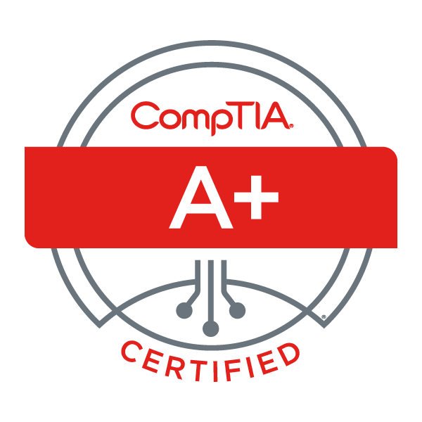
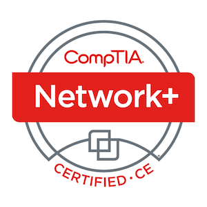

<h1> Hi there, I'm Jorge 👋 <h1>
<h2> 👨‍💻 Cybesecurity & Coding Projects:</h2>

- <b>    </b>
  - [JMenterprises](https://jmenterprises.netlify.app/) </b></i>
  My personal website, built from scratch, where I showcase my tutorials, labs, and other IT-related projects.
  A series of hands-on labs demonstrating various cybersecurity techniques and tools, from configuring SOHO routers to running Nmap scans.
  
  - [Calculator_GUI](https://github.com/Jorgemat10/Calculator_GUI.git)
  
- <b>PowerShell</b>
  - [Windows Active Directory and User Access Controls](https://github.com/Jorgemat10/ActiveDirectoryLab/tree/main)

- <b>   JAVA </b>
  - [Simple_Calculator](https://github.com/Jorgemat10/Calculator.git)

- <b>    Python</b>
  - [Integer_to_binary](https://github.com/Jorgemat10/Integer_to_binary.git)
  - [Perimeter & Area](https://github.com/Jorgemat10/Perimeter_Area.git)
 
  - 
  
- <b>    JavaScript</b>
  - [Password-checker](https://github.com/Jorgemat10/password-checker.git)
 
- <b>  MySQL </b>
  - [Employe_DB](https://github.com/Jorgemat10/Basic_SQL_db.git)
 
  
 

 
  
## 🎓 Certifications 
Here are some of the certifications I've earned:

    

<h3 align="left">Working and still learning:</h3>

   
    

